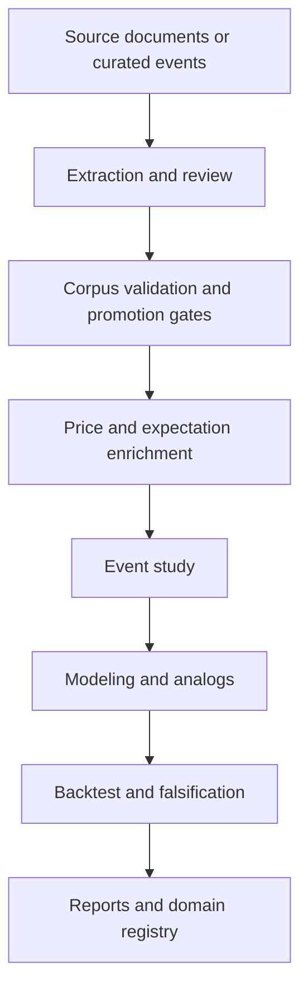

# Architecture Map

This repository is organized around a shared research core plus many
domain-specific parsers and readiness reports. New work should strengthen the
shared core when behavior is cross-domain, and stay inside a domain module when
the logic is source- or thesis-specific.

## Core Flow

## Core Modules

- `events.py`: required event schema, release-session validation, ticker lists
- `source_docs.py` and `ingestion.py`: source-document manifests and local text
  ingestion
- `extraction.py`: evidence-grounded fact extraction validation and expectation
  conversion
- `review.py`: review queues and evidence coverage fields
- `corpus.py`: current Python domain registry, templates, and corpus validation
- `domain_schema.py`: additive JSON schema scaffold for future domain migration
- `promotion.py`: hard model-readiness gate reports
- `timestamp_readiness.py`: explanatory versus execution-ready timestamp flags
- `expectations.py`, `release_times.py`, `options.py`,
  `analyst_revisions.py`: point-in-time feature enrichment
- `event_study.py`: abnormal-return measurement and labels
- `modeling.py` and `features.py`: baseline models, analogs, feature metadata,
  and optional issuer diagnostics
- `backtest.py`: walk-forward, calibration, strategy simulation, nested
  thresholds, null tests, placebo/peer controls, and concentration diagnostics
- `pipeline.py`: end-to-end orchestration and promotion-gated backtests

## Domain Modules

Domain modules such as `cybersecurity_incidents.py`, `activist_13d.py`,
`government_contracts.py`, `capital_raises.py`, and SEC-native domain files own
source-specific parsing, domain features, audit reports, and domain readiness
summaries.

New domains should start with source discovery and parser review queues. They
should not add modeling or backtest paths until source grounding, timestamp
audits, duplicate checks, and promotion gates are in place.

## Planned Direction

`DOMAIN_SPECS` in `corpus.py` remains the active template registry. The JSON
schemas under `schemas/domains/` are a scaffold for future migration toward
schema-driven templates, validation, feature selection, and promotion gates.
